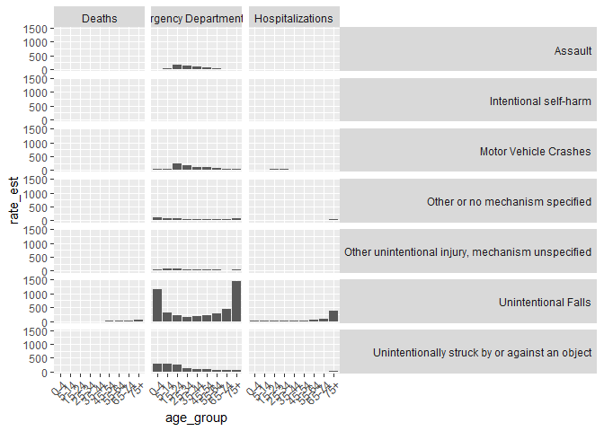
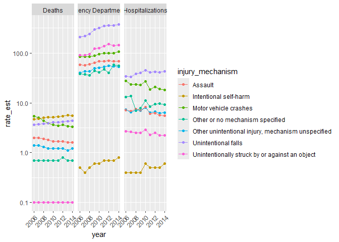

Traumatic Brain Injury
================
2025-04-28

## **QUESTION:**

## What age range receives the largest number of traumatic brain injuries?

## 

### **THE DATA:**

What data did you find to help answer that question?

- We found CDC data that grouped brain injury total and rate per 100,000
  estimates based on injury mechanism, age, type of measure (emergency
  visit, post-mortem examination, hospitalization) and year estimated

  - This will allow us to see what ages and what activities have the
    highest likelihoods of getting a TBI

### **RELEVANT BACKGROUND:**

- The CDC estimates totals nationwide based on the large quantity of
  data they have, so our numbers are not technically true, they are just
  really good guesses.

- The number of TBIs that america sees each year is in the hundreds of
  thousands

- There are three different ways that TBIs are reported

  - Hospitalization - anytime someone would be hospitalized temporarily
    by a TBI

  - Emergency Care - anytime a TBI would result in being brought to an
    emergency care facility (ER, urgent care, …)

  - Death - anytime a TBI is reported post-mortem

### **Basic EDA:**

``` r
knitr::opts_chunk$set(echo = TRUE)
library(tidyverse)
```

    ## ── Attaching core tidyverse packages ──────────────────────── tidyverse 2.0.0 ──
    ## ✔ dplyr     1.1.4     ✔ readr     2.1.5
    ## ✔ forcats   1.0.0     ✔ stringr   1.5.1
    ## ✔ ggplot2   3.5.1     ✔ tibble    3.2.1
    ## ✔ lubridate 1.9.4     ✔ tidyr     1.3.1
    ## ✔ purrr     1.0.2     
    ## ── Conflicts ────────────────────────────────────────── tidyverse_conflicts() ──
    ## ✖ dplyr::filter() masks stats::filter()
    ## ✖ dplyr::lag()    masks stats::lag()
    ## ℹ Use the conflicted package (<http://conflicted.r-lib.org/>) to force all conflicts to become errors

``` r
age_link <- ".\\tbi_age.csv"
military_link <- ".\\tbi_military.csv"
year_link <- ".\\tbi_year.csv"
tbi_age <-  read.csv(age_link)
tbi_military <-  read.csv(military_link)
tbi_year <-  read.csv(year_link)
tbi_age %>% 
  distinct(age_group)
```

    ##    age_group
    ## 1       0-17
    ## 2        0-4
    ## 3       5-14
    ## 4      15-24
    ## 5      25-34
    ## 6      35-44
    ## 7      45-54
    ## 8      55-64
    ## 9      65-74
    ## 10       75+
    ## 11     Total

``` r
tbi_year %>%
  distinct(year)
```

    ##   year
    ## 1 2006
    ## 2 2007
    ## 3 2008
    ## 4 2009
    ## 5 2010
    ## 6 2011
    ## 7 2012
    ## 8 2013
    ## 9 2014

``` r
tbi_age %>% 
  distinct(injury_mechanism)
```

    ##                                    injury_mechanism
    ## 1                             Motor Vehicle Crashes
    ## 2                               Unintentional Falls
    ## 3    Unintentionally struck by or against an object
    ## 4 Other unintentional injury, mechanism unspecified
    ## 5                             Intentional self-harm
    ## 6                                           Assault
    ## 7                   Other or no mechanism specified

``` r
tbi_age %>% 
  distinct(type)
```

    ##                         type
    ## 1 Emergency Department Visit
    ## 2           Hospitalizations
    ## 3                     Deaths

- tbi_age:

  - Five columns: age_group, type, injury_mechanism, number_est,
    rate_est

  - age_group: Categorizes ages 0-75+ into 9 bins of 10 years each

  - type: The result of the injury

    - Emergency Department Visit, Hospitalization, or Death

  - injury_mechanism: How the person got injured

    - Assault, Intentional Self-harm, Motor Vehicle Crashes, Other or no
      mechanism specified, Other unintentional injury (mechanism
      unspecified, Unintentional Falls, Unintentionally Struck By or
      Against an Object

  - number_est: Total number of TBI patients in that category

  - rate_est: Rate of TBI of that category per 100,000

- tbi_year: 

  - Five Columns: injury_mechanism, type, year, rate_est, number_est

  - Same definition for injury_mechamism, type, rate_est, and number_est
    as tbi_age

  - Year: Year the rate/number of patients was from spanning from every
    year between 2009 and 2014

- We chose not to use the military data and focus on just civilians so
  that we can more validly compare the age data and year data

``` r
tbi_age %>% 
  filter(age_group != "0-17", age_group !="Total") %>% 
  mutate(age_group = factor(age_group, levels = c("0-4", "5-14", "15-24", "25-34", 
                                                  "35-44", "45-54", "55-64", 
                                                  "65-74", "75+"))) %>% 
  ggplot(aes(age_group, rate_est)) +
  geom_col() +
  facet_grid(injury_mechanism ~ type) +
theme(
  strip.text.x = element_text(angle = 0, hjust = 0.5),
  strip.text.y = element_text(angle = 0, hjust = 1),
  axis.text.x = element_text(angle = 45, vjust = 1, hjust = 1)
)
```

    ## Warning: Removed 8 rows containing missing values or values outside the scale range
    ## (`geom_col()`).

<!-- -->

``` r
tbi_year %>% 
  filter(injury_mechanism != "Total") %>%
  ggplot(aes(year,rate_est, color = injury_mechanism)) +
  geom_point() +
  theme(axis.text.x = element_text(angle = 45, vjust = 1, hjust = 1)) +
  scale_y_log10() +
  facet_wrap(~type) +
  geom_line() 
```

<!-- -->

### Observations:

It seems that the highest rates come from injury mechanisms of
unintentional falls and other blows to the head and motor vehicle
crashes. In particular, the motor vehicle rates are high for people age
18-36, and unintentional fall rates are high for young and elderly
people.

### Quantified Uncertainty:

- We feel that it does not make sense for our data to come up with
  uncertainty ourselves, as we our working with quantified totals, which
  are already estimates themselves.

- Looking at the CDC data, we see that, before they updated their
  concussion research program in 2019, they quantified that they only
  captured the data of 1 in 9 concussions

  - <https://www.cdc.gov/traumatic-brain-injury/programs/index.html>

  - This is quite significant, but also, at the scale of hundreds of
    thousands (about 625,000), makes sense, and the trends you see from
    1/9 of this number most likely are quite similar. We cannot deny
    however, that there may be a non-report bias somehow - that there is
    a chance that certain cases are more likely to be reported, which
    would skew the data.

  - We personally feel that the CDC is a reputable source for good
    quality data, and are comfortable with the conclusions we make
    despite this mild uncertainty.

# Conclusion:

It seems that, across age groups, people aged 75+ and 0-4 are the most
at risk of getting a TBI, and through injury mechanism data, motor
vehicle drivers and people suffering from falls are the most at risk of
getting a TBI among all the things people are doing. It makes sense that
the highest proportion of traumatic brain injuries were for individuals
75+ years in age and from falling. This is because as people age they
lose balance and don’t realize the rapid rate at which they can no
longer control aspects of their body and movement.

### Remaining Questions:

- Is there a non-report bias?

- Are certain groups of people not shown in our data more likely to be
  affected by TBIs (thinking about ethnicity, gender, …)?
